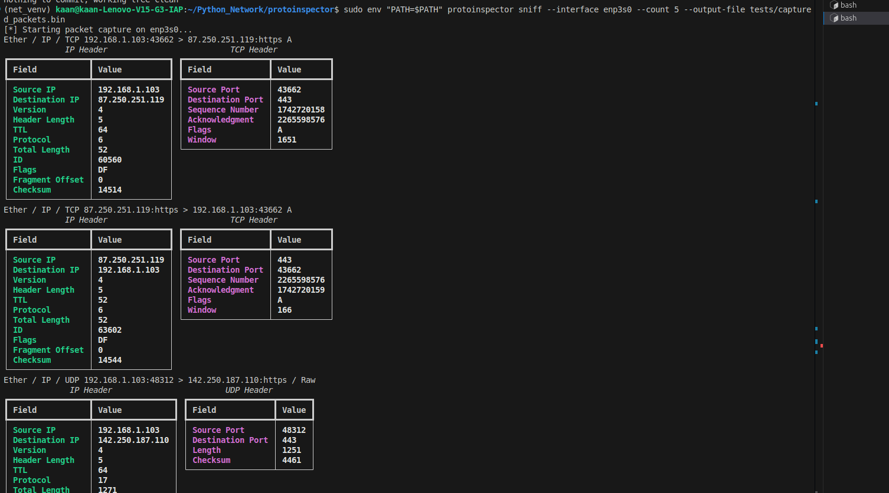

# ProtoInspector

ProtoInspector is a Python toolkit for network protocol analysis, injection, and sniffing.

## Features

- Protocol analysis
- Packet injection
- Network sniffing
- Modular and extensible design

## Project Structure

```
protoinspector/
    analyzer.py      # Protocol analysis logic
    injector.py      # Packet injection utilities
    main.py          # Entry point for CLI or main logic
    protocol.py      # Protocol definitions and helpers
    sniffer.py       # Network sniffing implementation
tests/
    test_analyzer.py
    test_injector.py
    test_protocol.py
    test_sniffer.py
```

## Installation

1. Clone the repository:
    ```sh
    git clone <your-repo-url>
    cd protoinspector
    ```

2. (Optional) Create a virtual environment:
    ```sh
    python3 -m venv net_venv
    source net_venv/bin/activate
    ```

3. Install dependencies:
    ```sh
    pip install -r requirements.txt
    ```

4. Install the package in editable mode:
    ```sh
    pip install -e .
    ```

## Usage

Run the main module:
```sh
python -m protoinspector.main
```

Or use the CLI if available (first activate venv):
```sh
sudo env "PATH=$PATH" protoinspector sniff --interface enp3s0 --count 5 --output-file tests/captured_packets.bin
```
## Screenshot



## Running Tests

```sh
pytest
```

## License

MIT License

---

*Edit this README to add more details about usage, contributing, and advanced features as