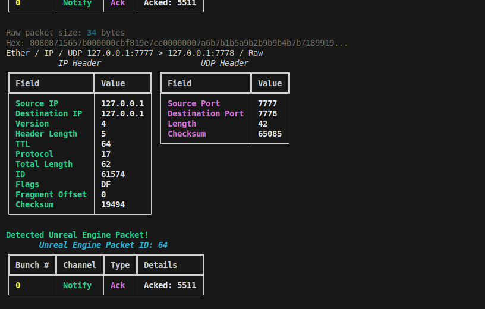
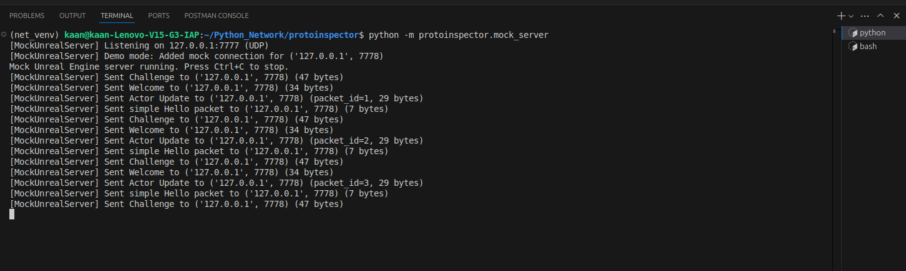
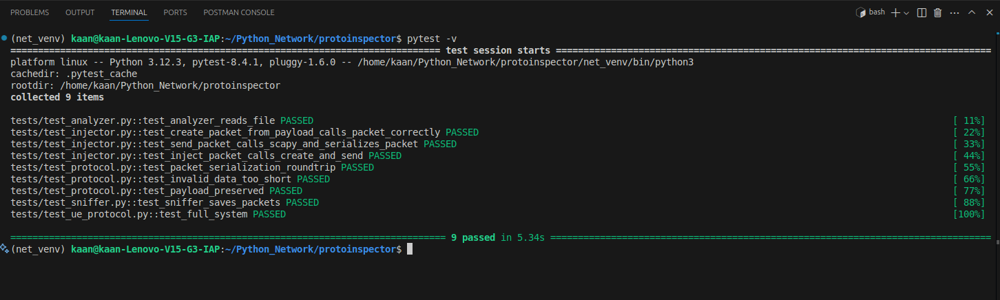

# ProtoInspector



**ProtoInspector** is a powerful Python tool for analyzing, sniffing, and injecting custom network packets, with a focus on Unreal Engine (UE4/UE5) protocols. It provides both CLI utilities and a mock server for testing and research.

---

## Features

- **Live Packet Sniffing:** Capture and analyze packets from any network interface using Scapy.
- **Packet Analysis:** Parse and display raw or captured Unreal Engine packets in a human-readable format.
- **Packet Injection:** Craft and send custom or UE-specific packets to a target server or client.
- **Mock Unreal Server:** Simulate a UE4/UE5 server for local testing and protocol research.
- **Session Analysis:** Detect sequence gaps, analyze actor updates, and RPC calls.
- **Rich CLI Output:** Uses [rich](https://github.com/Textualize/rich) for beautiful tables and colored output.

---

## Installation

1. **Clone the repository**
2. (Recommended) Create a virtual environment:
   ```bash
   python3 -m venv net_venv
   source net_venv/bin/activate
   ```
3. **Install dependencies:**
   ```bash
   pip install -r requirements.txt
   ```
4. **Install ProtoInspector (editable mode):**
   ```bash
   pip install -e .
   ```

---

## Usage

### CLI Commands

All commands are available via the `protoinspector` CLI:

#### 1. **Sniff Network Traffic**

```bash
protoinspector sniff -i <interface> [-c <count>] [-o <output_file>] [-p <port>]
```
- Capture packets live from a network interface.
- Save to a file for later analysis.

#### 2. **Analyze Packet File**

```bash
protoinspector analyze --file <raw_packet_file>
```
- Parse and display packets from a binary file.

#### 3. **Inject Custom Packet**

```bash
protoinspector inject --target-ip <ip> --payload <hex> [--protocol-id <id>] [--sequence <seq>] [--target-port <port>]
```
- Send a crafted packet to a target IP/port.

#### 4. **Inject Unreal Engine Packet**

```bash
protoinspector inject-ue --type <hello|login|movement|rpc> [--params <params>] [--target <ip>] [--port <port>]
```
- Send UE-specific packets (handshake, login, movement, RPC).

#### 5. **Run Mock Server**

```bash
python -m protoinspector.mock_server
```
- Start a local UDP server that simulates UE4/UE5 protocol for testing.



---

## Testing

Run all tests with:
```bash
pytest tests/
```



---

## Requirements
- Python 3.7+
- [scapy](https://scapy.net/)
- [bitstring](https://github.com/scott-griffiths/bitstring)
- [typer](https://typer.tiangolo.com/)
- [rich](https://github.com/Textualize/rich)

---

## Author
- **kemechial**

## License
MIT License

---

*ProtoInspector is ideal for network researchers, game protocol enthusiasts, and security testers working with Unreal Engine traffic.*
